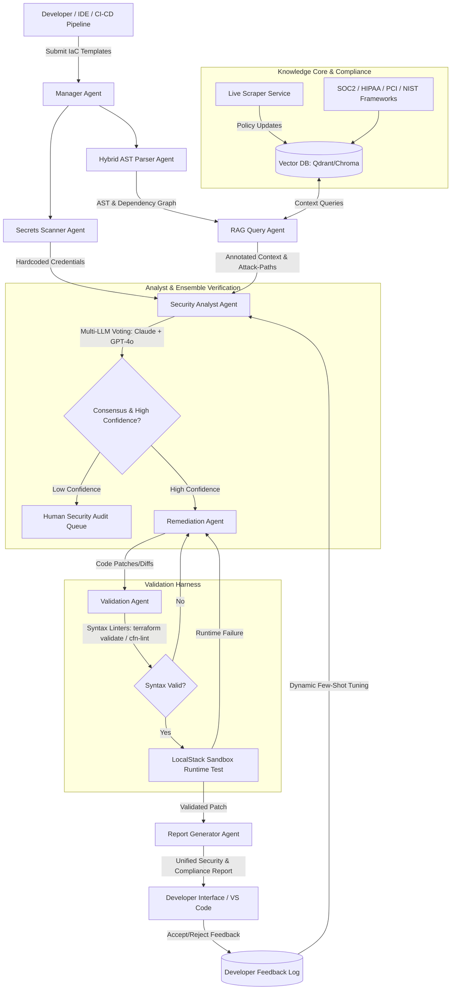

# AgentShield AI

## Autonomous Multi-Agent Framework for Multi-Cloud Infrastructure-as-Code Security


AgentShield AI is an advanced, autonomous multi-agent framework designed to secure Infrastructure-as-Code (IaC) templates across heterogeneous multi-cloud environments. The system leverages Large Language Models (LLMs), Retrieval-Augmented Generation (RAG), and static code analysis to perform context-aware vulnerability detection, automated patching, and developer-aligned security reporting.

---

## 📄 Project Metadata

* **Domain of the Project:** Cyber Security + AI
* **Team Number:** 13
* **Project Status:** Under Active Planning / Development
* **GitHub Repository Topics:** `iac-security`, `infrastructure-as-code`, `terraform`, `cloudformation`, `kubernetes`, `helm`, `multi-cloud`, `aws`, `azure`, `gcp`, `llm-agents`, `langgraph`, `rag`, `retrieval-augmented-generation`, `devsecops`, `static-analysis`, `checkov`, `cyber-security`, `ai-agents`, `security-automation`
* **Contributors (Team Members):**
  * **Anisha Paturi** (Roll No: `23BD1A050E`) - *Contact: 8639781680*
  * **Parinamika Bhanu** (Roll No: `23BD1A0518`) - *Contact: 9392508430*
  * **Vahini Venkata** (Roll No: `23BD1A051D`) - *Contact: 8790261823*
  * **Sravani Janak** (Roll No: `23BD1A051Y`) - *Contact: 7075869135*

---

## 💡 Abstract

Cloud-native applications increasingly rely on Infrastructure-as-Code (IaC) to automate the deployment and management of cloud resources. However, security misconfigurations in IaC templates can introduce critical vulnerabilities that are often overlooked by traditional rule-based security tools. This project presents **AgentShield AI**, an autonomous multi-agent framework designed to enhance Infrastructure-as-Code security across multi-cloud environments. 

The proposed system leverages Large Language Models (LLMs), Retrieval-Augmented Generation (RAG), and a curated cloud security knowledge base to perform context-aware vulnerability detection and intelligent security analysis. Unlike existing solutions that are limited to a single cloud platform, AgentShield AI supports multiple IaC platforms, providing a unified security analysis framework. The system employs specialized AI agents for IaC parsing, knowledge retrieval, vulnerability detection, automated remediation, and report generation, enabling a modular and scalable security workflow. 

By combining semantic reasoning with domain-specific security knowledge, the framework generates actionable remediation recommendations and comprehensive security reports that can be integrated into DevSecOps pipelines. The proposed solution aims to improve detection accuracy, reduce manual security analysis effort, and provide a scalable approach to securing cloud infrastructure across heterogeneous cloud environments.

---

## 🎯 Research Base Paper & Core Enhancements

AgentShield AI is designed as a direct improvement on the following base paper:
> **Base Paper:** Toprani, D., & Madisetti, V. K. (2025). *LLM Agentic Workflow for Automated Vulnerability Detection and Remediation in Infrastructure-as-Code.* (IEEE Access)

While the base paper proposes an initial agent-based workflow for cloud security, it features several critical limitations. AgentShield AI overcomes these limitations with the following comprehensive enhancements:

### 1. Multi-Cloud & Multi-IaC Generalization
* **Base Paper Limitation:** Evaluated exclusively on AWS CloudFormation.
* **AgentShield AI Improvement:** Extends support to **Microsoft Azure** and **Google Cloud Platform (GCP)**, parsing multiple IaC formats including **Terraform (HCL)**, **Kubernetes Manifests**, and **Helm Charts** alongside CloudFormation.

### 2. Autonomous Multi-Agent Orchestration
* **Base Paper Limitation:** Employs a basic linear pipeline (Retrieve -> Detect -> Report) with limited agent autonomy.
* **AgentShield AI Improvement:** Employs an advanced, collaborative multi-agent architecture using a stateful orchestrator (LangGraph). The system includes specialized agents:
  * **Manager/Router Agent:** Directs execution flow and work allocation.
  * **Hybrid Parser Agent:** Performs syntax extraction, AST construction, and pre-evaluates conditionals.
  * **Secrets Scanner Agent:** Scans for hardcoded secrets, API keys, and credentials.
  * **RAG-Query Agent:** Retrieves cloud-specific security policies and compliance mappings.
  * **Security Analyst Agent:** Performs vulnerability verification via multi-LLM ensemble voting and confidence scoring.
  * **Remediation Agent:** Generates code-level diff patches with compliance tags.
  * **Code & Sandbox Validator Agent:** Performs syntax linting and sandbox runtime testing on patches.
  * **Report Agent:** Formats developers' feedback logs, compliance frameworks, and audit documentation.

### 3. Syntax & Context Pre-Screening (Hybrid Parsing)
* **Base Paper Limitation:** Struggles to interpret complex conditional resource instantiation or variable configurations, causing false positives.
* **AgentShield AI Improvement:** Integrates static code analysis scanners (Checkov, tfsec, KICS) to construct a complete Abstract Syntax Tree (AST) and Dependency Graph of the IaC code, pre-evaluating variable values and environment contexts before LLM processing.

### 4. Dynamic Auto-Patching and Lint Validation
* **Base Paper Limitation:** Only provides natural language explanations and generic mitigation advice, requiring manual code edits.
* **AgentShield AI Improvement:** Automatically generates syntax-compliant **patch files (diffs)** for direct integration. Patches are dry-run validated using local compilers/linters (e.g., `terraform validate` or `cfn-lint`) to ensure security fixes compile cleanly.

### 5. Automated Knowledge Base Continuous Ingestion (CI)
* **Base Paper Limitation:** Relies on a manually curated, static knowledge base of AWS rules that quickly goes out of date.
* **AgentShield AI Improvement:** Features an automated pipeline that pulls daily security feeds, CVE databases, and official vendor documentation updates to continuously update a vectorized knowledge store.

### 6. Interactive Developer Feedback Loop
* **Base Paper Limitation:** Lacks feedback mechanisms, preventing the LLM from adapting to organization-specific exceptions.
* **AgentShield AI Improvement:** Introduces a feedback capture layer. If a developer rejects or overrides a suggested fix, the system saves the preference as negative-shot feedback, adapting prompt context and suppressing redundant future alerts.

### 7. Confidence Scoring & Uncertainty Estimation
* **Base Paper Limitation:** Treats all findings with uniform binary certainty without confidence quantification, contributing to a ~15% false-positive rate.
* **AgentShield AI Improvement:** The Security Analyst Agent computes a calibrated confidence score per finding (derived from RAG retrieval similarity scores and LLM self-consistency sampling across multiple runs). Low-confidence findings are automatically routed to human security analyst review instead of auto-flagging, directly attacking the false-positive problem.

### 8. Rigorous, Automated Benchmarking & Ablation Harness
* **Base Paper Limitation:** Evaluation relied on only 10 manually-annotated templates, representing a significant evaluation weakness.
* **AgentShield AI Improvement:** Implements an automated benchmark harness evaluated against public vulnerable-IaC corpora (Terragoat, cfngoat, KICS/Checkov test fixtures, IaC-Eval) computing reproducible Precision, Recall, and F1 scores, alongside ablation studies (RAG on/off, hybrid parsing on/off) to quantify component contributions.

### 9. Multi-LLM Cross-Verification & Ensemble Voting
* **Base Paper Limitation:** Single-LLM evaluation is vulnerable to hallucinated findings and model-specific bias.
* **AgentShield AI Improvement:** Runs the Security Analyst step through multi-LLM cross-verification (e.g., Claude + GPT-4o). Findings are auto-confirmed only when models reach consensus; disagreements are escalated for human security review, providing a cost-effective lever against hallucinations.

### 10. Attack-Path & Blast-Radius Aware Prioritization
* **Base Paper Limitation:** Assigns flat static severity per misconfiguration without evaluating topology context or resource interdependencies.
* **AgentShield AI Improvement:** Constructs a resource dependency graph during hybrid parsing and layers attack-path analysis on top (e.g., identifying a public S3 bucket readable by an IAM role with RDS admin privileges). Fixes are prioritized by real exploitability and blast radius rather than raw static rule severity.

### 11. Compliance-Framework Mapping
* **Base Paper Limitation:** Outputs generic best-practice references without mapping to formal regulatory or compliance standards.
* **AgentShield AI Improvement:** Automatically tags every finding against **SOC 2**, **HIPAA**, **PCI-DSS**, and **NIST 800-53** controls in the report output, equipping security teams with audit-ready documentation.

### 12. Dedicated Secrets & Credential Scanning Agent
* **Base Paper Limitation:** Completely omits hardcoded secrets and credential scanning in IaC templates.
* **AgentShield AI Improvement:** Integrates a specialized Secrets Scanning Agent (utilizing Gitleaks and TruffleHog engines) to detect hardcoded API keys, passwords, and private tokens embedded in IaC variables and resource definitions.

### 13. Cost and Latency Optimization Pipeline
* **Base Paper Limitation:** High latency of 80–100s per template scan fails to scale to enterprise-grade repositories.
* **AgentShield AI Improvement:** Implements embedding-based resource deduplication (skipping re-analysis of near-identical resource blocks), response caching keyed by AST resource hashes, and a lightweight local distilled model as a first-pass filter before escalating ambiguous cases to full LLM agents.

### 14. Sandbox-Validated Patch Testing (Beyond Syntax)
* **Base Paper Limitation:** Validates patches via syntax checking only, without verifying runtime deployment integrity.
* **AgentShield AI Improvement:** Goes beyond syntax linting by spinning up patched templates in an isolated local sandbox (e.g., LocalStack for AWS) to confirm the fix preserves intended infrastructure functionality and provisions without runtime errors.

### 15. Shift-Left IDE & Pre-Commit Integration
* **Base Paper Limitation:** Restricted to post-commit or CI/CD pipeline scans.
* **AgentShield AI Improvement:** Shifts security evaluation further left by providing VS Code IDE extensions and git pre-commit hooks, giving developers real-time security feedback during IaC authoring before code is committed.

### 16. Drift Detection Against Live Infrastructure
* **Base Paper Limitation:** Limited to static code analysis of local IaC files, failing to detect out-of-band manual changes in deployed environments.
* **AgentShield AI Improvement:** Periodically diffs deployed cloud resources via provider APIs against the IaC source of truth, catching manual out-of-band changes that reintroduce vulnerabilities previously caught in IaC scans.

---

## 🏗️ System Architecture



---

## 🛠️ Technology Stack & Tools

* **Programming Language:** Python 3.12+
* **Orchestration & State Management:** LangGraph / LangChain
* **Vector DB / RAG Ingestion:** ChromaDB / Qdrant & sentence-transformers
* **Static Scanners & Secrets Engines:** Checkov, tfsec, KICS, Gitleaks, TruffleHog
* **Language Models:** Anthropic Claude (via Amazon Bedrock / API), OpenAI GPT-4o, Local Distilled SLM
* **Validation & Sandbox:** LocalStack (AWS Emulation), `terraform validate`, `cfn-lint`
* **Development Utilities:** `uv` (Fast package management), Docker, Pytest

---

## 📅 Implementation Roadmap

### Phase 1: Foundation, Ingestion Parsers & Secrets Agent (Weeks 1-3)
* [x] Project structure setup and CLI skeleton.
* [x] Implementation of local HCL, JSON, and YAML parsers.
* [x] Static scanner integration for resource attribute enrichment.
* [ ] Dedicated Secrets & Credential Scanning Agent (Gitleaks / TruffleHog).

### Phase 2: Multi-Cloud Knowledge Base & RAG Compliance (Weeks 4-6)
* [ ] Setup of the vector database and scraping scheduler.
* [ ] Ingestion of CIS Benchmarks, cloud security docs, and SOC 2 / HIPAA / PCI-DSS / NIST 800-53 controls.
* [ ] Optimization of semantic retrieval matching algorithms & AST hash caching.

### Phase 3: Multi-Agent Core, Ensemble Voting & Confidence Scoring (Weeks 7-9)
* [ ] Implementation of the LangGraph state machine with cost/latency AST deduplication.
* [ ] Security Analyst Agent with Multi-LLM ensemble voting (Claude + GPT-4o) and confidence scoring.
* [ ] Escalation routing for low-confidence / non-consensus findings to human review queues.

### Phase 4: Patching, Sandbox Auto-Validation & Attack-Path Prioritization (Weeks 10-12)
* [ ] AST-level dependency graph construction & attack-path exploitability ranking.
* [ ] Sandbox auto-validation harness using LocalStack runtime provisioning and local linters (`terraform validate`, `cfn-lint`).
* [ ] Developer feedback loop schema implementation.

### Phase 5: Shift-Left IDE, Live Drift & Automated Benchmarking (Weeks 13-14)
* [ ] VS Code Extension & Git pre-commit hook integration.
* [ ] Live infrastructure drift detection via Cloud Provider APIs.
* [ ] Automated benchmark harness execution against Terragoat, cfngoat, KICS/Checkov test fixtures, and IaC-Eval with ablation studies.

---

## 📂 Project Structure

```
AgentShield-AI/
├── .gitignore               # Root gitignore file
├── README.md                # Project documentation
├── LLM_Agentic_Workflow_for_Automated_Vulnerability_Detection_and_Remediation_in_Infrastructure-as-Code.pdf # Research base paper
├── project abstract.docx    # Project abstract document
└── backend/
    ├── .python-version
    ├── .env                 # Local environment config (API keys, ports)
    ├── .env.example         # Template for environment configuration
    ├── pyproject.toml       # Python package configuration and dependencies
    ├── uv.lock              # Lock file generated by uv
    ├── main.py              # Skeleton runner
    ├── agentshield/         # Core application package
    │   ├── __init__.py
    │   ├── __main__.py      # Package entry point for execution
    │   ├── cli.py           # Click-based CLI entry point
    │   ├── agents/          # Autonomous agents modules
    │   ├── knowledge_base/  # Vector storage and ingestion
    │   ├── parsers/         # Ingestion and syntax parsing (HCL, YAML, JSON)
    │   │   ├── __init__.py
    │   │   ├── cfn_parser.py # CloudFormation JSON/YAML parser
    │   │   ├── k8s_parser.py # Kubernetes multi-document YAML parser
    │   │   ├── tf_parser.py  # HCL/Terraform parser
    │   │   ├── line_loader.py# Custom line number tracking SafeLoader
    │   │   └── schemas.py    # Shared Pydantic data schemas
    │   └── utils/           # Utility helpers
    │       ├── __init__.py
    │       └── checkov_runner.py # Checkov static analysis runner
    ├── tests/               # Unit and integration test suite
    │   ├── __init__.py
    │   ├── fixtures/
    │   │   └── terraform/
    │   │       └── sample.tf # Sample Terraform template for parser testing
    │   ├── test_checkov_runner.py # Checkov integration tests
    │   ├── test_cli.py            # CLI command tests
    │   ├── test_parsers.py        # CloudFormation and Kubernetes parser tests
    │   └── tf_parser_test.py      # HCL/Terraform parser tests
    └── infrastructure/      # Test IaC files
        ├── terraform/
        │   └── main.tf      # Sample vulnerable AWS S3 bucket template
        ├── cloudformation/
        │   └── s3_bucket.json # Sample vulnerable CloudFormation JSON template
        └── kubernetes/
            └── pod_root.yaml  # Sample vulnerable/safe Kubernetes YAML manifests
```

---

## 🚀 Getting Started

### 1. Vector Database Setup (Qdrant)
To start the Qdrant vector database using Docker:
```powershell
docker run -d `
  --name agentshield-qdrant `
  -p 6333:6333 `
  -p 6334:6334 `
  qdrant/qdrant
```

### 2. Local Python Environment Setup
We use `uv` for python environment and dependency management.

1. Navigate to the backend folder:
   ```bash
   cd backend
   ```
2. Setup the virtual environment and install packages:
   ```bash
   uv sync
   ```

Alternatively, if you prefer installing package requirements manually using standard `pip`:
```bash
pip install python-hcl2 pytest
```
> [!IMPORTANT]
> Since Checkov depends on Bridgecrew's fork (`bc-python-hcl2`) for line number tracking in HCL files, if you encounter an error saying `ImportError: cannot import name 'START_LINE' from 'hcl2'`, please uninstall `python-hcl2` and install `bc-python-hcl2` instead.


### 3. Configure Environment Variables
Create a `.env` file in the `backend` folder and supply your API keys (e.g. Gemini, OpenRouter, etc.):
```bash
# Copy the template env
cp .env.example .env
```
Ensure your `.env` contains:
```env
GEMINI_API_KEY=your-gemini-api-key-here
OPENROUTER_API_KEY=your-openrouter-api-key-here
```

### 4. Run the Scan Command
To run a scan, navigate to the `backend/` folder and execute the CLI using `uv`. Below is a detailed breakdown of how to execute scans for each framework, what they return, and what those results mean:

#### A. Scanning Terraform (HCL)
**Command:**
```bash
uv run python -m agentshield scan --path ./infrastructure/terraform/
```
* **What it returns:** Findings targeting HCL resource blocks (such as `aws_s3_bucket` and `aws_s3_bucket_public_access_block`).
* **What it means:** These findings identify instances where resource configurations violate cloud provider security best practices (e.g., exposing an S3 bucket publicly, missing server-side encryption, or lack of bucket access logs).

#### B. Scanning CloudFormation (JSON)
**Command:**
```bash
uv run python -m agentshield scan --path ./infrastructure/cloudformation/
```
* **What it returns:** Findings targeting resources declared under the `"Resources"` section of the JSON/YAML template (such as `AWS::S3::Bucket`).
* **What it means:** Identifies that your CloudFormation JSON template will provision insecure infrastructure once deployed (e.g., missing block public access defaults, disabled versioning, or lack of read-permission locks).

#### C. Scanning Kubernetes (YAML)
**Command:**
```bash
uv run python -m agentshield scan --path ./infrastructure/kubernetes/
```
* **What it returns:** Findings targeting workload manifest documents (such as `Pod` specifications), including multi-document files separated by `---`.
* **What it means:** Evaluates pod specifications against standard Pod Security Standards (PSS). It flags containers running in privileged mode (which could allow container escaping), running as the root user `0`, lacking CPU/memory limits, or missing network policies.

---

### 5. Run the Test Suite
To verify that all parsers, integration runners, and CLI command bindings work properly, execute the test suite:
```bash
uv run pytest
```

---


## 📄 License
This project is licensed under the MIT License - see the LICENSE file for details.
