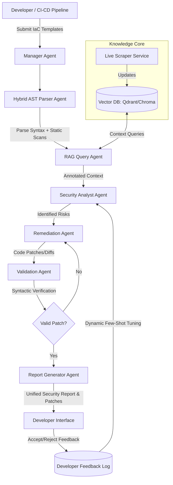

# AgentShield AI

## Autonomous Multi-Agent Framework for Multi-Cloud Infrastructure-as-Code Security

AgentShield AI is an advanced, autonomous multi-agent framework designed to secure Infrastructure-as-Code (IaC) templates across heterogeneous multi-cloud environments. The system leverages Large Language Models (LLMs), Retrieval-Augmented Generation (RAG), and static code analysis to perform context-aware vulnerability detection, automated patching, and developer-aligned security reporting.

---

## 📄 Project Metadata

* **Domain of the Project:** Cyber Security + AI
* **Team Number:** 13
* **Project Status:** Under Active Planning / Development
* **Contributors (Team Members):**
  * **Anisha Paturi** (Roll No: `23BD1A050E`) - *Contact: 8639781680*
  * **Parinamika Bhanu** (Roll No: `23BD1A0518`) - *Contact: 9392508430*
  * **Vahini Venkata** (Roll No: `23BD1A051D`) - *Contact: 8790261823*
  * **Sravani Janak** (Roll No: `23BD1A051Y`) - *Contact: 7075869135*

---

## 💡 Abstract

Cloud-native applications increasingly rely on Infrastructure-as-Code (IaC) to automate the deployment and management of cloud resources. However, security misconfigurations in IaC templates can introduce critical vulnerabilities that are often overlooked by traditional rule-based security tools. This project presents **AgentShield AI**, an autonomous multi-agent framework designed to enhance Infrastructure-as-Code security across multi-cloud environments. 

The proposed system leverages Large Language Models (LLMs), Retrieval-Augmented Generation (RAG), and a curated cloud security knowledge base to perform context-aware vulnerability detection and intelligent security analysis. Unlike existing solutions that are limited to a single cloud platform, AgentShield AI supports multiple IaC platforms, providing a unified security analysis framework. The system employs specialized AI agents for IaC parsing, knowledge retrieval, vulnerability detection, automated remediation, and report generation, enabling a modular and scalable security workflow. 

By combining semantic reasoning with domain-specific security knowledge, the framework generates actionable remediation recommendations and comprehensive security reports that can be integrated into DevSecOps pipelines. The proposed solution aims to improve detection accuracy, reduce manual security analysis effort, and provide a scalable approach to securing cloud infrastructure across heterogeneous cloud environments.

---

## 🎯 Research Base Paper & Core Enhancements

AgentShield AI is designed as a direct improvement on the following base paper:
> **Base Paper:** Toprani, D., & Madisetti, V. K. (2025). *LLM Agentic Workflow for Automated Vulnerability Detection and Remediation in Infrastructure-as-Code.* (IEEE Access)

While the base paper proposes an initial agent-based workflow for cloud security, it features several critical limitations. AgentShield AI overcomes these limitations with the following enhancements:

### 1. Multi-Cloud & Multi-IaC Generalization
* **Base Paper Limitation:** Evaluated exclusively on AWS CloudFormation.
* **AgentShield AI Improvement:** Extends support to **Microsoft Azure** and **Google Cloud Platform (GCP)**, and parses multiple IaC formats including **Terraform (HCL)**, **Kubernetes Manifests**, and **Helm Charts** alongside CloudFormation.

### 2. Autonomous Multi-Agent Orchestration
* **Base Paper Limitation:** Employs a basic linear pipeline (Retrieve -> Detect -> Report) with limited agent autonomy.
* **AgentShield AI Improvement:** Employs an advanced, collaborative multi-agent architecture using a stateful orchestrator (e.g., LangGraph). The system includes specialized agents:
  * **Manager/Router Agent:** Directs execution flow.
  * **Hybrid Parser Agent:** Performs syntax extraction and pre-evaluates conditionals.
  * **RAG-Query Agent:** Retrieves cloud-specific policies.
  * **Security Analyst Agent:** Performs vulnerability verification.
  * **Remediation Agent:** Generates code-level fixes.
  * **Code Validator Agent:** Runs syntax checking on suggested patches.
  * **Report Agent:** Formats developers' feedback logs.

### 3. Syntax & Context Pre-Screening (Hybrid Parsing)
* **Base Paper Limitation:** Struggles to interpret complex conditional resource instantiation or variable configurations, causing false positives.
* **AgentShield AI Improvement:** Integrates standard static code analysis scanners (such as Checkov, tfsec, or KICS) to construct a complete Abstract Syntax Tree (AST) and Dependency Graph of the IaC code. Variable values and environments are pre-evaluated before sending code segments to the LLM.

### 4. Dynamic Auto-Patching and Lint Validation
* **Base Paper Limitation:** Only provides natural language explanations and generic mitigation advice, requiring manual code edits.
* **AgentShield AI Improvement:** Automatically generates syntax-compliant **patch files (diffs)** for direct integration. These patches are automatically dry-run validated using local compilers/linters (e.g., `terraform validate` or `cfn-lint`) to ensure the generated security fix does not break infrastructure compiles.

### 5. Automated Knowledge Base Continuous Ingestion (CI)
* **Base Paper Limitation:** Relies on a manually curated, static knowledge base of AWS rules that quickly goes out of date.
* **AgentShield AI Improvement:** Features an automated pipeline that pulls daily security feeds, CVE databases, and official vendor documentation updates to continuously update a vectorized knowledge store.

### 6. Interactive Developer Feedback Loop
* **Base Paper Limitation:** Lacks feedback mechanisms, meaning the LLM cannot learn from its mistakes or adapt to organization-specific exceptions.
* **AgentShield AI Improvement:** Introduces a feedback capture layer. If a developer rejects or overrides a suggested fix, the system saves the preference as negative-shot feedback, adapting the prompt context and suppressing future redundant alerts.

---

## 🏗️ System Architecture



---

## 🛠️ Technology Stack & Tools

* **Programming Language:** Python 3.12+
* **Orchestration & State Management:** LangGraph / LangChain
* **Vector DB / RAG Ingestion:** ChromaDB / Qdrant & sentence-transformers
* **Static Scanners (Hybrid Parsing):** Checkov, tfsec, KICS
* **Language Models:** Anthropic Claude (via Amazon Bedrock / API) or OpenAI GPT-4o
* **Development Utilities:** `uv` (Fast package management), Docker, Pytest

---

## 📅 Implementation Roadmap

### Phase 1: Foundation and Ingestion Parsers (Weeks 1-3)
* Project structure setup and CLI skeleton.
* Implementation of local HCL, JSON, and YAML parsers.
* Static scanner integration for resource attribute enrichment.

### Phase 2: Multi-Cloud Knowledge Base & RAG (Weeks 4-6)
* Setup of the vector database and scraping scheduler.
* Ingestion of CIS Benchmarks and cloud provider security documentation.
* Optimization of semantic retrieval matching algorithms.

### Phase 3: Core Multi-Agent Network (Weeks 7-9)
* Implementation of the LangGraph state machine.
* Prompt engineering and validation of Analyst and Remediation Agents.
* JSON schema output structures (Pydantic models).

### Phase 4: Patching & Auto-Validation (Weeks 10-12)
* AST-level patch application logic.
* Auto-validation harness using local toolchains (`terraform validate`, `cfn-lint`).
* Developer feedback loop schema implementation.

### Phase 5: CI/CD Plugins & Reporting (Weeks 13-14)
* GitHub Actions runner setup.
* Final reports generation (Markdown & JSON exports).
* System benchmarking against vulnerable repository datasets (e.g., Terragoat).

---

## 📂 Project Structure

```
AgentShield-AI/
├── .gitignore               # Root gitignore file
├── README.md                # Project documentation
└── backend/
    ├── .python-version
    ├── .env                 # Local environment config (API keys, ports)
    ├── .env.example         # Template for environment configuration
    ├── pyproject.toml       # Python package configuration and dependencies
    ├── uv.lock              # Lock file generated by uv
    ├── main.py              # Skeleton runner
    ├── agentshield/         # Core application package
    │   ├── __init__.py
    │   ├── __main__.py      # Package entry point for execution
    │   ├── cli.py           # Click-based CLI entry point
    │   ├── agents/          # Autonomous agents modules
    │   ├── knowledge_base/  # Vector storage and ingestion
    │   ├── parsers/         # Ingestion and syntax parsing (HCL, YAML, JSON)
    │   └── utils/           # Utility helpers
    ├── tests/               # Unit and integration test suite
    │   ├── __init__.py
    │   └── test_cli.py
    └── infrastructure/      # Test IaC files
        └── terraform/
            └── main.tf      # Sample vulnerable AWS S3 bucket template
```

---

## 🚀 Getting Started

### 1. Vector Database Setup (Qdrant)
To start the Qdrant vector database using Docker:
```powershell
docker run -d `
  --name agentshield-qdrant `
  -p 6333:6333 `
  -p 6334:6334 `
  qdrant/qdrant
```

### 2. Local Python Environment Setup
We use `uv` for python environment and dependency management.

1. Navigate to the backend folder:
   ```bash
   cd backend
   ```
2. Setup the virtual environment and install packages:
   ```bash
   uv sync
   ```

### 3. Configure Environment Variables
Create a `.env` file in the `backend` folder and supply your API keys (e.g. Gemini, OpenRouter, etc.):
```bash
# Copy the template env
cp .env.example .env
```
Ensure your `.env` contains:
```env
GEMINI_API_KEY=your-gemini-api-key-here
OPENROUTER_API_KEY=your-openrouter-api-key-here
```

### 4. Run the Scan Command
Run the minimal CLI scanner using `uv`:
```bash
uv run python -m agentshield scan --path ./infrastructure/terraform/
```

---


## 📄 License
This project is licensed under the MIT License - see the LICENSE file for details.
