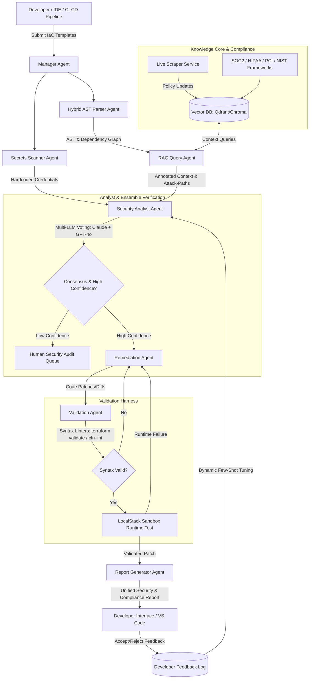

# AgentShield AI

## Autonomous Multi-Agent Framework for Multi-Cloud Infrastructure-as-Code Security


AgentShield AI is an advanced, autonomous multi-agent framework designed to secure Infrastructure-as-Code (IaC) templates across heterogeneous multi-cloud environments. The system leverages Large Language Models (LLMs), Retrieval-Augmented Generation (RAG), and static code analysis to perform context-aware vulnerability detection, automated code patching, and developer-aligned security reporting.

---

## 📄 Project Metadata

* **Domain of the Project:** Cyber Security + AI
* **Team Number:** 13
* **Project Status:** Under Active Planning / Development
* **GitHub Repository Topics:** `iac-security`, `infrastructure-as-code`, `terraform`, `cloudformation`, `kubernetes`, `helm`, `multi-cloud`, `aws`, `azure`, `gcp`, `llm-agents`, `langgraph`, `rag`, `retrieval-augmented-generation`, `devsecops`, `static-analysis`, `checkov`, `cyber-security`, `ai-agents`, `security-automation`
* **Contributors (Team Members):**
  * **Anisha Paturi** (Roll No: `23BD1A050E`) - *Contact: 8639781680*
  * **Parinamika Bhanu** (Roll No: `23BD1A0518`) - *Contact: 9392508430*
  * **Vahini Venkata** (Roll No: `23BD1A051D`) - *Contact: 8790261823*
  * **Sravani Janak** (Roll No: `23BD1A051Y`) - *Contact: 7075869135*

---

## 📚 Foundational Project Documents

The repository contains key foundational documents detailing the architectural specifications, research literature survey, presentation slides, and base research paper:

* 🏗️ **[about.md](file:///C:/Users/anish/OneDrive/College/project-clg/AgenShield-AI/about.md):** Detailed architecture guide describing the 8 specialized agents, LangGraph orchestration graph, and comparative feature breakdown against the base paper.
* 🌐 **[index.html](file:///C:/Users/anish/OneDrive/College/project-clg/AgenShield-AI/index.html):** Interactive web presentation summarizing core objectives, multi-agent pipeline, expected results, strengths, and limitations of AgentShield AI.
* 📖 **[literature_survey.txt](file:///C:/Users/anish/OneDrive/College/project-clg/AgenShield-AI/literature_survey.txt):** In-depth literature survey categorizing existing IaC security approaches, identifying critical research gaps, providing a comprehensive comparative matrix, and listing key academic references.
* 📝 **`project abstract.docx`:** Executive abstract and project overview document.
* 📑 **[LLM Base Paper](file:///C:/Users/anish/OneDrive/College/project-clg/AgenShield-AI/LLM_Agentic_Workflow_for_Automated_Vulnerability_Detection_and_Remediation_in_Infrastructure-as-Code.pdf):** Base research paper (*Toprani & Madisetti, IEEE Access 2025*).

---

## 💡 Abstract

Cloud-native applications increasingly rely on Infrastructure-as-Code (IaC) to automate the deployment and management of cloud resources. However, security misconfigurations in IaC templates can introduce critical vulnerabilities that are often overlooked by traditional rule-based security tools. This project presents **AgentShield AI**, an autonomous multi-agent framework designed to enhance Infrastructure-as-Code security across multi-cloud environments. 

The proposed system leverages Large Language Models (LLMs), Retrieval-Augmented Generation (RAG), and a curated cloud security knowledge base to perform context-aware vulnerability detection and intelligent security analysis. Unlike existing solutions that are limited to a single cloud platform, AgentShield AI supports multiple IaC platforms, providing a unified security analysis framework. The system employs specialized AI agents for IaC parsing, knowledge retrieval, vulnerability detection, automated remediation, and report generation, enabling a modular and scalable security workflow. 

By combining semantic reasoning with domain-specific security knowledge, the framework generates actionable remediation recommendations and comprehensive security reports that can be integrated into DevSecOps pipelines. The proposed solution aims to improve detection accuracy, reduce manual security analysis effort, and provide a scalable approach to securing cloud infrastructure across heterogeneous cloud environments.

---

## 📊 Literature Survey & Comparative Analysis

As detailed in `literature_survey.txt`, current research and commercial offerings in IaC security can be categorized into four primary paradigms:

1. **Static Analysis & Rule-Based Scanners (e.g., CDK-Nag, Checkov, KICS):**
   * *Mechanism:* Parses IaC code against pre-defined, rigid rule packs.
   * *Limitation:* Misses complex, context-dependent misconfigurations (e.g., compound IAM policy risks) and generates high false-positive rates with parameterized/dynamic templates.
2. **Dynamic Analysis & CSPM (e.g., AWS Config, Cloud Security Posture Management):**
   * *Mechanism:* Monitors live cloud resources post-deployment via cloud provider APIs.
   * *Limitation:* Reactive ("shift-right"); fails to catch vulnerabilities before infrastructure is provisioned.
3. **ML-Based Security Smell Detectors (e.g., GLITCH - Saavedra & Ferreira, 2022):**
   * *Mechanism:* Uses machine learning models on intermediate representations across IaC languages.
   * *Limitation:* Requires massive labeled training datasets, struggles with zero-day misconfiguration patterns, and lacks code remediation generation.
4. **LLM & Early Agentic Workflows (Base Paper - Toprani & Madisetti, 2025; GenKubeSec - Malul et al., 2024):**
   * *Mechanism:* Combines LLMs with basic RAG for context-aware vulnerability detection.
   * *Limitation:* Single-cloud scope (CloudFormation only), single-LLM hallucination risks (~15% false-positive rate), text-only recommendations without patch generation, and limited benchmark evaluation.

### Comparative Feature Matrix

| Feature / Metric | Static Scanners (Checkov) | CSPM (AWS Config) | Base Paper (Toprani, 2025) | AgentShield AI (Proposed) |
| :--- | :--- | :--- | :--- | :--- |
| **Analysis Timing** | Pre-commit / CI | Post-deployment | Pre-deployment | Shift-Left (IDE + Pre-commit + CI + Live Drift) |
| **Cloud & IaC Scope** | Multi-Cloud | Live Cloud APIs | AWS CloudFormation only | AWS, Azure, GCP across Terraform, CFN, K8s, & Helm |
| **Context Reasoning** | ❌ Rigid Rules | ❌ State Rules | ⚠️ LLM + RAG | ✅ AST + RAG + Multi-LLM Ensemble (Claude + GPT-4o) |
| **Remediation Output** | Rule Links | Alert Notices | Text Explanations | Syntax & Sandbox-Validated Code Diff Patches |
| **Secrets Scanning** | Basic Regex | ❌ None | ❌ None | Dedicated Secrets Agent (Gitleaks + TruffleHog) |
| **Validation Harness** | ❌ None | ❌ None | ❌ None | Static Linters + LocalStack Runtime Sandbox Testing |
| **Compliance Mapping** | Basic | Rule-level | ❌ None | Automated mapping to SOC 2, HIPAA, PCI-DSS, & NIST 800-53 |
| **Developer Feedback** | ❌ None | ❌ None | ❌ None | Interactive feedback loop & negative-shot prompt adaptation |

---

## 🎯 Research Base Paper & Core Enhancements

AgentShield AI is designed as a direct improvement on the following base paper:
> **Base Paper:** Toprani, D., & Madisetti, V. K. (2025). *LLM Agentic Workflow for Automated Vulnerability Detection and Remediation in Infrastructure-as-Code.* IEEE Access, 13, 69175-69181.

AgentShield AI addresses the critical research gaps of the base paper through comprehensive enhancements:

### Key Research Gaps Addressed

1. **Multi-Cloud & Multi-IaC Generalization:** Extends beyond AWS CloudFormation to **Microsoft Azure** and **Google Cloud Platform (GCP)** across **Terraform (HCL)**, **Kubernetes Manifests**, and **Helm Charts**.
2. **Autonomous 8-Agent Architecture:** Replaces the basic 3-agent linear pipeline with a stateful LangGraph multi-agent network with specialized roles.
3. **Hybrid AST Parsing & Pre-Screening:** Combines AST parsing with static scanners (Checkov, tfsec, KICS) to pre-evaluate conditionals and variables before LLM analysis.
4. **Dynamic Auto-Patching & Linters:** Replaces text explanations with syntactically valid code diff patches tested against local linters (`terraform validate`, `cfn-lint`).
5. **Sandbox Runtime Validation:** Validates patches inside a local sandbox (LocalStack) to confirm provision integrity without breaking infrastructure functionality.
6. **Dedicated Secrets Scanning:** Integrates Gitleaks and TruffleHog engines to intercept embedded credentials, API keys, and certificates.
7. **Multi-LLM Ensemble Voting & Confidence Scoring:** Runs cross-verification (Claude 3.5 + GPT-4o) to eliminate hallucinations, routing low-confidence alerts to human review.
8. **Compliance Framework Mapping:** Automatically tags findings with **SOC 2**, **HIPAA**, **PCI-DSS**, and **NIST 800-53** regulatory controls.
9. **Interactive Developer Feedback:** Captures developer accept/reject actions for dynamic negative-shot prompt tuning.
10. **Attack-Path & Blast-Radius Prioritization:** Constructs resource dependency graphs to prioritize vulnerabilities based on real exploitability and topological impact.
11. **Shift-Left & Live Drift Detection:** Integrates VS Code extensions, pre-commit hooks, and live infrastructure drift detection via provider APIs.
12. **Automated Continuous Knowledge Base Ingestion:** Pulls daily CVE feeds and vendor documentation into Qdrant/ChromaDB vector stores.

---

## 🏗️ System Architecture & Specialized Agents

### LangGraph Multi-Agent Architecture


```mermaid
graph TD
    A[Developer / IDE / CI-CD Pipeline] -->|Submit IaC Templates| B[Manager Agent]
    B --> C[Hybrid AST Parser Agent]
    B --> SEC[Secrets Scanner Agent]
    C -->|AST & Dependency Graph| D[RAG Query Agent]
    SEC -->|Hardcoded Credentials| G[Security Analyst Agent]
    
    subgraph "Knowledge Core & Compliance"
        E[(Vector DB: Qdrant/Chroma)]
        F[Live Scraper Service] -->|Policy Updates| E
        COMP[SOC2 / HIPAA / PCI / NIST Frameworks] --> E
    end
    
    E <-->|Context Queries| D
    D -->|Annotated Context & Attack-Paths| G
    
    subgraph "Analyst & Ensemble Verification"
        G -->|Multi-LLM Voting: Claude + GPT-4o| V{Consensus & High Confidence?}
        V -->|Low Confidence| HMN[Human Security Audit Queue]
        V -->|High Confidence| H[Remediation Agent]
    end
    
    H -->|Code Patches/Diffs| I[Validation Agent]
    
    subgraph "Validation Harness"
        I -->|Syntax Linters: terraform validate / cfn-lint| J1{Syntax Valid?}
        J1 -->|No| H
        J1 -->|Yes| J2[LocalStack Sandbox Runtime Test]
        J2 -->|Runtime Failure| H
    end
    
    J2 -->|Validated Patch| K[Report Generator Agent]
    
    K -->|Unified Security & Compliance Report| L[Developer Interface / VS Code]
    L -->|Accept/Reject Feedback| M[(Developer Feedback Log)]
    M -->|Dynamic Few-Shot Tuning| G
```

### The 8 Specialized Agents of AgentShield AI

1. **Manager/Router Agent:** Directs execution state, handles routing, and allocates tasks among agents.
2. **Hybrid AST Parser Agent:** Extracts ASTs from HCL, CloudFormation JSON/YAML, Kubernetes YAML, and Helm templates, evaluating dynamic variables and pre-resolving parameters.
3. **Secrets Scanner Agent:** Executes integrated Gitleaks and TruffleHog engines to intercept hardcoded API keys, tokens, and credentials.
4. **RAG-Query Agent:** Interrogates vector databases (Qdrant/ChromaDB) for multi-cloud security policies, CIS benchmarks, and regulatory compliance controls.
5. **Security Analyst Agent:** Performs Multi-LLM Ensemble Voting (Claude 3.5 + GPT-4o) with calibrated confidence scoring. Escalates low-confidence findings to a human security queue.
6. **Remediation Agent:** Generates clean, executable code diff patches targeting specific IaC resource blocks instead of natural language text.
7. **Code & Sandbox Validator Agent:** Verifies code syntax via local linters (`terraform validate`, `cfn-lint`) and performs runtime dry-run deployment inside LocalStack.
8. **Report Agent:** Generates audit-ready compliance reports (SOC 2, HIPAA, PCI-DSS, NIST 800-53) and stores developer feedback for continuous prompt adaptation.

---

## 🛠️ Technology Stack & Tools

* **Programming Language:** Python 3.12+
* **Orchestration & State Management:** LangGraph / LangChain
* **Vector DB / RAG Ingestion:** Qdrant / ChromaDB & `sentence-transformers`
* **Static Scanners & Secrets Engines:** Checkov, tfsec, KICS, Gitleaks, TruffleHog
* **Language Models:** Anthropic Claude 3.5 (via Bedrock/API), OpenAI GPT-4o, Local Distilled SLM
* **Validation & Sandbox:** LocalStack (AWS Emulation), `terraform validate`, `cfn-lint`
* **Development Utilities:** `uv` (Fast Python package manager), Docker, Pytest

---

## 📅 Detailed Implementation Plan & Execution Roadmap

AgentShield AI is being developed across **5 distinct execution phases over a 14-week timeline**. Each phase delivers fully functional, testable modules mapped directly to our 8-agent architecture, RAG knowledge core, validation harness, and developer interfaces.

---

### 🗓️ Phase 1: Foundation, Multi-IaC Ingestion & Core Documentation (Weeks 1–3)
**Objective:** Establish the project repository infrastructure, build foundational documentation, implement multi-cloud AST parsers, and deploy the secrets scanning engine.

* [x] **Task 1.1: Project Setup & Environment Initialization**
  * Configure fast dependency management via `uv`, set up `pyproject.toml`, and establish automated `pytest` test suites.
  * Define core data contracts (`IaCTemplate`, `ASTNode`, `VulnerabilityReport`, `PatchDiff`) using Pydantic v2 schemas.
* [ ] **Task 1.2: System Core & Manager/Router Agent State Machine**
  * Build the initial LangGraph orchestration state graph for workflow control and message passing.
  * Implement state persistence, fallback mechanisms, and conditional graph routing between agents.
* [ ] **Task 1.3: Multi-Cloud Hybrid AST Parser Agent**
  * Develop AST parsers for **Terraform (HCL2)**, **AWS CloudFormation (JSON/YAML)**, **Kubernetes Manifests (YAML)**, and **Helm Charts**.
  * Implement dynamic variable pre-resolution, conditional evaluation, and resource dependency graph extraction.
* [ ] **Task 1.4: Dedicated Secrets & Credential Scanner Agent**
  * Integrate **Gitleaks** and **TruffleHog** engines with high-entropy regex pattern matching.
  * Implement automated interception for API keys, AWS credentials, JWT tokens, and private keys embedded in IaC files.
* [ ] **Task 1.5: Static Scanner Adapter Layer**
  * Build wrapper adapters for **Checkov**, **tfsec**, and **KICS** to enrich parsed AST nodes with baseline vulnerability signals.

**Key Deliverables:** Ingestion pipeline, multi-format IaC parser, secrets scanner agent, and foundational docs ([about.md](file:///C:/Users/anish/OneDrive/College/project-clg/AgenShield-AI/about.md), [index.html](file:///C:/Users/anish/OneDrive/College/project-clg/AgenShield-AI/index.html), [literature_survey.txt](file:///C:/Users/anish/OneDrive/College/project-clg/AgenShield-AI/literature_survey.txt)).

---

### 🗓️ Phase 2: Multi-Cloud Knowledge Base & RAG Compliance Core (Weeks 4–6)
**Objective:** Build the vector database pipeline, ingest multi-cloud security standards, and implement the RAG Query Agent for compliance context retrieval.

* [ ] **Task 2.1: Vector DB Infrastructure & Embedding Pipeline**
  * Deploy **Qdrant** / **ChromaDB** vector database instance with `sentence-transformers` (e.g., `all-mpnet-base-v2` / BGE embeddings).
  * Build an AST hash caching and semantic deduplication layer to accelerate similarity lookups.
* [ ] **Task 2.2: Continuous Knowledge Base Ingestion Engine**
  * Build automated scrapers and ingestors for AWS/Azure/GCP Security Best Practices, CIS Benchmarks, and NVD/CVE feeds.
  * Create a continuous updater service to refresh threat intelligence daily.
* [ ] **Task 2.3: Regulatory Compliance Mapping Module**
  * Index and crosswalk security policies against **SOC 2**, **HIPAA**, **PCI-DSS**, and **NIST 800-53** frameworks.
  * Annotate vector embeddings with explicit regulatory control IDs (e.g., `NIST-AC-6`, `PCI-DSS-1.3`).
* [ ] **Task 2.4: RAG Query Agent Development**
  * Implement context-aware hybrid retrieval combining dense vector similarity with sparse BM25 keyword search.
  * Develop prompt contextualizer to inject relevant security controls into the Security Analyst Agent's working memory.

**Key Deliverables:** Fully indexed vector DB, continuous ingestion scraper service, and working RAG Query Agent.

---

### 🗓️ Phase 3: LangGraph Multi-Agent Core, Ensemble Voting & Confidence Scoring (Weeks 7–9)
**Objective:** Complete the stateful 8-agent LangGraph network, implement Multi-LLM ensemble voting, and build the human audit review queue.

* [ ] **Task 3.1: Security Analyst Agent & Multi-LLM Ensemble Engine**
  * Connect **Claude 3.5 Sonnet** and **OpenAI GPT-4o** APIs for dual-model parallel vulnerability evaluation.
  * Implement structured reasoning templates (Chain-of-Thought prompting) enforcing standardized output JSON schemas.
* [ ] **Task 3.2: Calibrated Confidence Scoring & Consensus Algorithm**
  * Develop mathematical agreement scoring between LLM outputs to eliminate single-model hallucinations.
  * Establish confidence thresholds ($C \ge 0.85$ for auto-patching, $C < 0.85$ for human review).
* [ ] **Task 3.3: Attack-Path & Blast-Radius Prioritization Engine**
  * Construct resource topological graph to evaluate exploitability routes (e.g., Internet Gateway $\rightarrow$ Security Group $\rightarrow$ Unencrypted DB).
  * Rank findings based on combined severity, blast radius, and topological exposure.
* [ ] **Task 3.4: Human Security Audit Queue & Triage Dashboard**
  * Build an automated escalation mechanism for low-confidence or non-consensus findings.
  * Implement a CLI/Web triage interface allowing security engineers to inspect, approve, or reject flagged findings.

**Key Deliverables:** Multi-LLM ensemble engine, calibrated consensus algorithm, attack-path ranker, and human review queue.

---

### 🗓️ Phase 4: Auto-Patch Remediation, LocalStack Validation & Feedback Engine (Weeks 10–12)
**Objective:** Generate executable unified diff patches, build the LocalStack dry-run validation harness, and implement developer feedback loops.

* [ ] **Task 4.1: Remediation Agent & Executable Code Patch Generator**
  * Implement code diff generator producing clean, syntactically correct patches targeting exact IaC resource blocks.
  * Support patch generation across HCL2, CloudFormation JSON/YAML, K8s YAML, and Helm values.
* [ ] **Task 4.2: Code & Sandbox Validator Agent — Static Linters**
  * Integrate static verification tools (`terraform validate`, `tflint`, `cfn-lint`, `kube-linter`, `helm lint`).
  * Enforce automated rollback to the Remediation Agent if lint errors are detected in generated patches.
* [ ] **Task 4.3: LocalStack Runtime Dry-Run Sandbox Testing**
  * Configure **LocalStack** containerized sandbox for dry-run provisioning of AWS CloudFormation/Terraform resources.
  * Validate that patches do not cause deployment failures or resource dependency breakages.
* [ ] **Task 4.4: Report Generator Agent & Compliance Exporter**
  * Build report generator supporting JSON, Markdown, HTML, SARIF (for GitHub Security tab), and PDF exports.
  * Include executive summaries, attack-path diagrams, patch diffs, and compliance mapping matrices.
* [ ] **Task 4.5: Interactive Developer Feedback & Few-Shot Prompt Adaptation Engine**
  * Capture developer accept/reject decisions on generated patches.
  * Feed negative/positive decisions into a dynamic few-shot prompt adaptation store to continuously reduce false positives.

**Key Deliverables:** Patch generator, linter + LocalStack sandbox validator, multi-format report exporter, and feedback learning engine.

---

### 🗓️ Phase 5: Shift-Left IDE Integration, Live Drift & Automated Benchmarking (Weeks 13–14)
**Objective:** Embed security into developer workflows via IDE extensions and CI/CD hooks, enable live cloud drift detection, and execute rigorous empirical benchmark evaluations.

* [ ] **Task 5.1: VS Code Extension & Git Pre-Commit Hooks**
  * Develop lightweight **VS Code Extension** for real-time IaC security feedback inside the code editor.
  * Package Git pre-commit hooks to block misconfigured IaC templates before commits are recorded.
* [ ] **Task 5.2: Live Cloud Infrastructure Drift Detection Engine**
  * Build Cloud Provider API monitors (AWS Config / Azure Resource Graph / GCP Asset Inventory wrappers) to detect manual, out-of-band state changes.
  * Map live infrastructure drift against IaC source templates to trigger remediation workflows.
* [ ] **Task 5.3: Empirical Benchmark Harness & Ablation Studies**
  * Execute automated evaluations against public vulnerable IaC corpora (**Terragoat**, **cfngoat**, **KICS/Checkov test suites**, **IaC-Eval**).
  * Calculate performance metrics: **Precision**, **Recall**, **F1-Score**, **Patch Pass Rate**, and **Execution Latency**.
  * Perform comprehensive component ablation studies comparing:
    1. Baseline Static Scanners (Checkov) vs. Base Paper vs. AgentShield AI.
    2. RAG ON vs. RAG OFF.
    3. Multi-LLM Ensemble (Claude + GPT-4o) vs. Single-LLM (Claude 3.5 only).
    4. Hybrid AST Parsing vs. Raw Text LLM Ingestion.

**Key Deliverables:** VS Code extension, pre-commit hooks, live drift monitor, benchmark evaluation suite, and final ablation analysis report.

---

### 📊 Implementation Milestone Summary

| Milestone | Target Window | Key Focus Area | Validation Metric | Status |
| :--- | :--- | :--- | :--- | :--- |
| **M1: Parser & Secrets Core** | Weeks 1–3 | Multi-IaC AST parsing & credential interception | 100% test pass on parsing HCL, CFN, K8s, Helm | ⏳ In Progress |
| **M2: Knowledge Core & RAG** | Weeks 4–6 | Vector DB, CIS benchmarks, compliance mapping | Retrieval Precision @ 5 $\ge 90\%$ | 🎯 Scheduled |
| **M3: Ensemble & Consensus** | Weeks 7–9 | LangGraph 8-Agent network & Multi-LLM voting | Hallucination rate $< 3\%$, F1 $\ge 0.92$ | 🎯 Scheduled |
| **M4: Validation & Patching** | Weeks 10–12 | Diff patch generation & LocalStack sandbox | $100\%$ syntax validity, patch pass rate $\ge 95\%$ | 🎯 Scheduled |
| **M5: Shift-Left & Benchmarks**| Weeks 13–14 | IDE extension, pre-commit, ablation benchmarks | Full benchmark suite execution vs. IEEE paper | 🎯 Scheduled |

---


## 📂 Project Structure

```
AgentShield-AI/
├── .gitignore               # Git ignore configuration
├── README.md                # Primary project documentation
├── about.md                 # System architecture & specialized 8-agent breakdown
├── index.html               # Interactive web presentation (objectives, pipeline, results)
├── literature_survey.txt    # IaC security literature survey, gaps, & comparative matrix
├── project abstract.docx    # Executive abstract and project overview document
└── LLM_Agentic_Workflow_for_Automated_Vulnerability_Detection_and_Remediation_in_Infrastructure-as-Code.pdf # IEEE Access base paper
```

---

## 📚 References & Academic Citations

1. **Toprani, D., & Madisetti, V. K. (2025).** *LLM Agentic Workflow for Automated Vulnerability Detection and Remediation in Infrastructure-as-Code.* IEEE Access, 13, 69175-69181. *(Base Paper)*
2. **Saavedra, N., & Ferreira, J. F. (2022).** *GLITCH: Automated polyglot security smell detection in infrastructure as code.* arXiv:2205.14371.
3. **Malul, E., et al. (2024).** *GenKubeSec: LLM-based kubernetes misconfiguration detection, localization, reasoning, and remediation.* arXiv:2405.19954.
4. **Minna, F., et al. (2024).** *Analyzing and mitigating (with LLMs) the security misconfigurations of helm charts.* arXiv:2403.09537.

---

## 📄 License
This project is licensed under the MIT License - see the LICENSE file for details.
