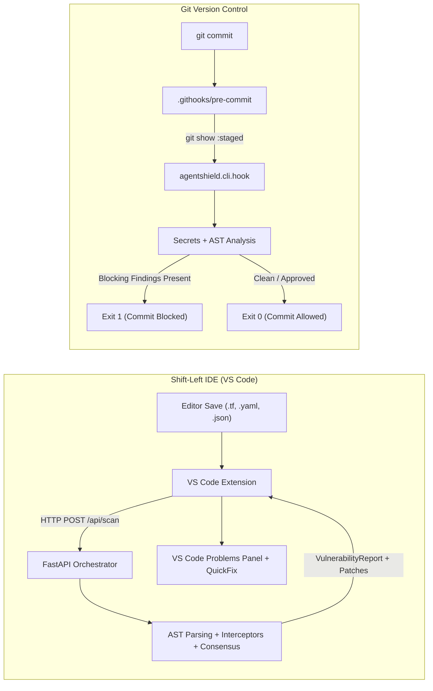

# Phase 5.1: Shift-Left IDE Integration & Pre-Commit Protection Guide

This guide details the architecture, configuration, installation, testing, and operational lifecycle of **Task 5.1: Shift-Left IDE Integration & Pre-Commit Hook**.

---

## 🏛️ Architecture Overview

The Shift-Left subsystem operates across two developer touchpoints:
1. **VS Code Extension (`integrations/vscode/`):** Evaluates Infrastructure-as-Code files dynamically on save or on-demand, reporting security issues through native VS Code Diagnostics and the Problems panel with one-click patch application.
2. **Git Pre-Commit Hook (`.githooks/pre-commit` & `backend/src/agentshield/cli/hook.py`):** Intercepts commits before they enter the repository history by extracting staged content from the Git index, scanning for secrets and high-severity flaws, and failing safe on violations.



---

## 📦 Supported Infrastructure-as-Code Formats

AgentShield Shift-Left integration natively evaluates:
- **Terraform:** `.tf`, `.tfvars`
- **AWS CloudFormation:** `.yaml`, `.yml`, `.json`
- **Kubernetes Manifests:** `.yaml`, `.yml`
- **Helm Charts:** `Chart.yaml`, `values.yaml`

---

## 🛡️ Blocking Policy Matrix

The Pre-Commit Hook enforces a deterministic security threshold:

| Finding Category | Default Hook Policy | Strict Policy (`--strict`) | VS Code Diagnostic |
| :--- | :--- | :--- | :--- |
| **Hardcoded Secrets** | **BLOCKED** (Exit 1) | **BLOCKED** (Exit 1) | Error (Red Squiggle) |
| **CRITICAL Severity** | **BLOCKED** (Exit 1) | **BLOCKED** (Exit 1) | Error (Red Squiggle) |
| **HIGH Severity** | **BLOCKED** (Exit 1) | **BLOCKED** (Exit 1) | Error (Red Squiggle) |
| **MEDIUM Severity** | Advisory Warning (Exit 0) | **BLOCKED** (Exit 1) | Warning (Yellow Squiggle) |
| **LOW Severity** | Advisory Warning (Exit 0) | Advisory Warning (Exit 0) | Information (Blue Squiggle) |
| **Scanner Failure** | **BLOCKED** (Exit 1, Fail-Safe) | **BLOCKED** (Exit 1, Fail-Safe) | Offline / Warning Status |

---

## 🔧 Installation Instructions

### 1. Git Pre-Commit Hook Activation
To enable the pre-commit hook in your local Git repository:

```bash
# Configure Git to recognize repository hooks
git config core.hooksPath .githooks

# On Unix/macOS, ensure the hook is executable
chmod +x .githooks/pre-commit
```

Alternatively, invoke the Python runner directly:
```bash
python -m agentshield.cli.hook path/to/template.tf
```

To auto-apply validated remediation diffs:
```bash
python -m agentshield.cli.hook --fix path/to/template.tf
```

### 2. VS Code Extension Installation
1. Open VS Code in `integrations/vscode/`:
   ```bash
   cd integrations/vscode
   code .
   ```
2. Press `F5` to start debugging with the Extension Development Host.
3. Open any Terraform or Kubernetes file to see instant security diagnostics.

---

## ⚙️ Configuration Properties

### VS Code Settings (`settings.json`)
```json
{
  "agentshield.apiUrl": "http://localhost:8000",
  "agentshield.scanOnSave": true,
  "agentshield.strictMode": false,
  "agentshield.authToken": "",
  "agentshield.timeoutMs": 10000
}
```

---

## 🧪 Verification & Automated Testing

Run the full Shift-Left test suite:

```bash
# Python Pre-Commit Hook Tests (8 Scenarios)
python -m pytest backend/tests/test_hook.py -v

# Node.js VS Code Extension Unit Tests (5 Scenarios)
node --test integrations/vscode/test/extension.test.js
```
